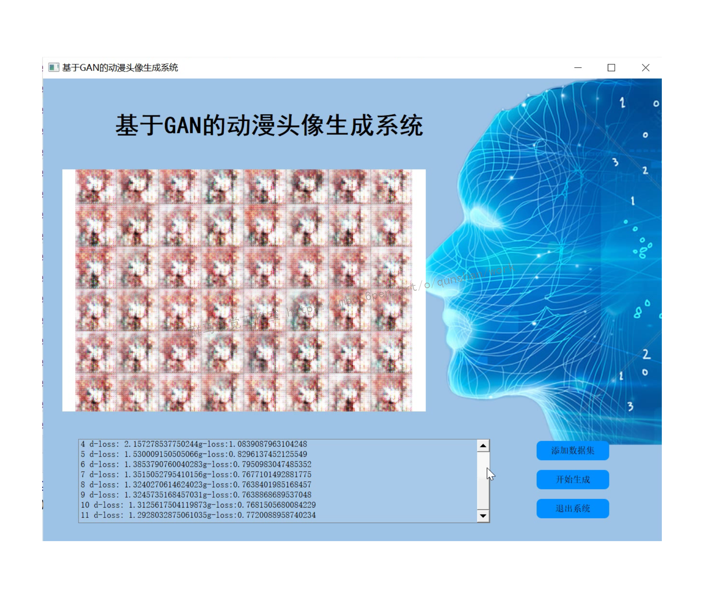
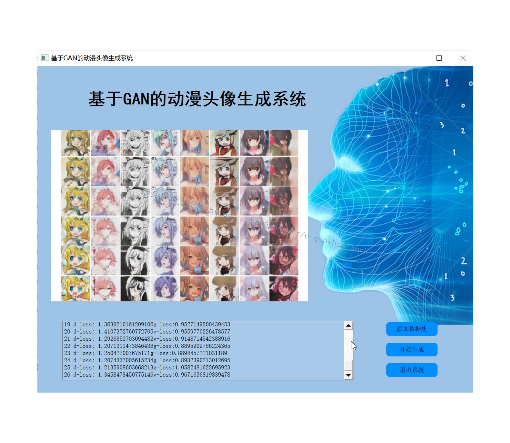
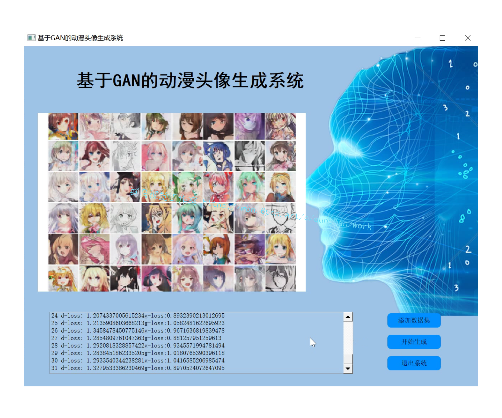
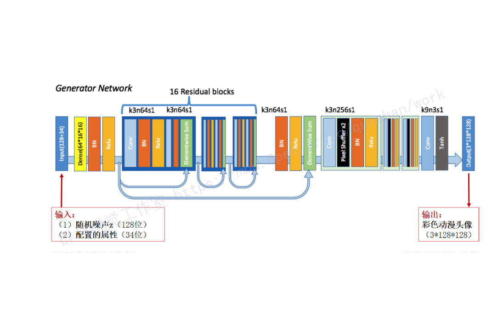
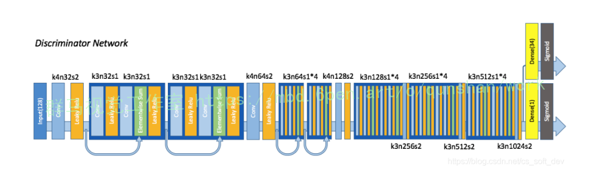
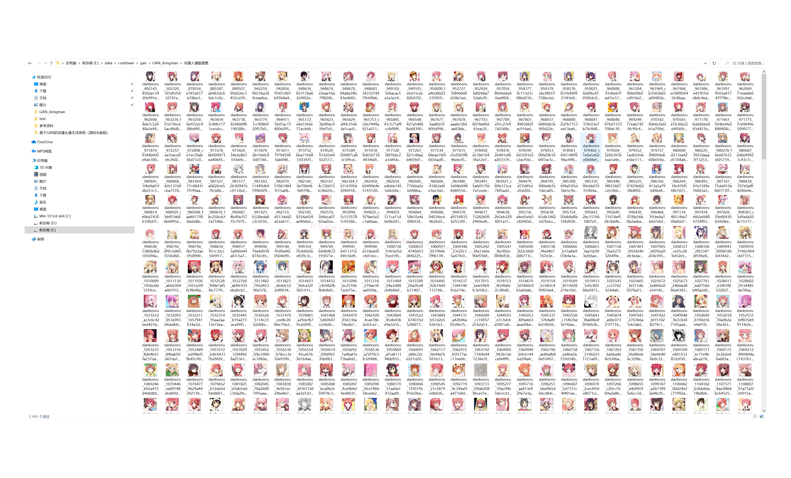
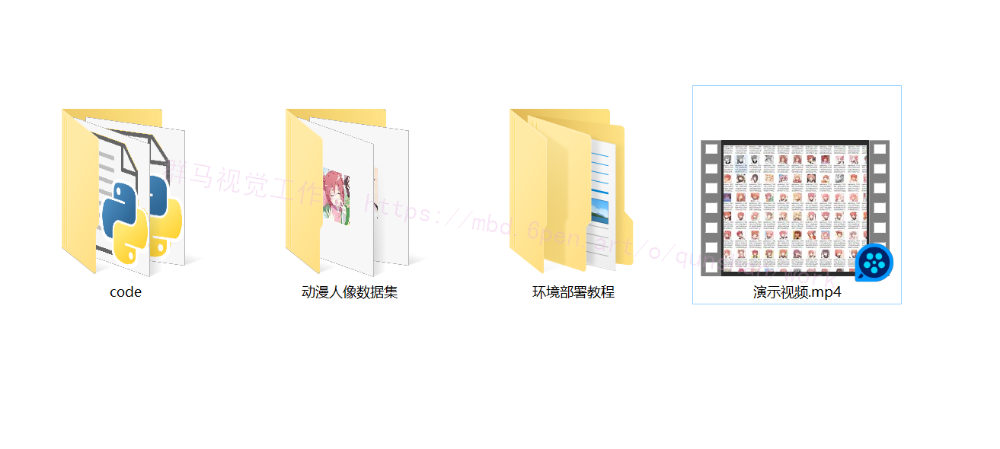

# 1.研究背景
我们都喜欢动漫角色，并试图创造我们的定制角色。然而，要掌握绘画技巧需要巨大的努力，之后我们首先有能力设计自己的角色。为了弥补这一差距，动画角色的自动生成提供了一个机会，在没有专业技能的情况下引入定制角色的存在。除了对非专业人士的好处外，专业的创造者还可以利用自动生成来获得动画和游戏角色设计的灵感；Doujin RPG开发者可以使用无版权的面部图像来降低游戏制作的设计成本。

# 2.图片演示






# 3.视频演示

[基于GAN的动漫头像生成系统（源码＆教程）_哔哩哔哩_bilibili](https://www.bilibili.com/video/BV1FN4y1P7kw/?spm_id_from=333.999.0.0&vd_source=bc9aec86d164b67a7004b996143742dc)

# 4.项目难点
（1）如何根据用户设置的属性，对GAN的生成结果进行精确控制？（注意GAN是黑盒模型）
（2）模型的生成结果由用户设置的属性和随机噪声（随机数）共同决定。因此，即使设置的属性不变，每次生成的头像都有所差异。那么如何既保证属性控制的精确性，又保证生成头像的随机性？
（3）如何把不同属性的组合，无缝地融合到同一张头像中？
（4）[之前提出的头像生成方法](https://mbd.pub/o/bread/Y5mbmpdq)，其输出结果存在模糊和画面混乱的问题，而且生成结果的质量很不稳定。那么，如何让模型生成高质量的头像？如何让模型以较高的成功率输出高质量的结果？

# 5.网络结构

#### 生成器


#### 判别器


# 6.数据集的准备


 要想训练出高质量的动漫头像生成模型，其必要前提为：数据集中的插画质量高、绘画风格一致、噪声小。现有的大规模插画数据集虽然提供了大量插画，但存在绘画风格差异巨大、数据集内噪声多等问题。为了避免这些问题，本文选择了一个游戏销售网站上的“游戏人物介绍插画”作为数据来源。

 在批量下载的插画中，如何自动找出头像所在区域的坐标？[论文使用基于Local Binary Pattern（LBP）特征的“人脸检测”（Face Detection）算法 \[foot note-6\]](https://afdian.net/item?plan_id=b679c95a599511ed973552540025c377)。为了使检测结果包含发型，将算法输出的检测框（bounding box）放大为原来的1.5倍。

  一个值得思考的问题：当拥有了带有属性标注的头像数据集之后，为什么还需要训练头像自动生成模型？“数据集”能否代替“自动生成模型”？ {*}
（1）理论上，当数据集的规模趋于无限大，使得每种可能的属性组合都包含大量例子时，可能不太需要再训练自动生成模型。但实际上，随着属性数量的增多，可能出现的属性组合数会呈爆炸式增长！而高质量头像的设计和绘制需要较高成本，所以不太可能拥有如此大规模的数据集。
 另外，笔者认为应该从“创新”（而不是“模仿”）的角度来思考这一问题：
（2）GAN生成器以随机噪声作为输入，使得即使设置的属性完全相同，每次生成的结果也会发生微小但随机的变化。这是图片总数固定的数据集所无法实现的。
（3）GAN能够生成数据集中不存在的属性组合。例如数据集中分别有蓝发的头像和绿眼的头像，但没有蓝发绿眼的头像。而经过训练后，GAN能够生成蓝发绿眼的头像。（前提是GAN已充分学习了蓝发的特征和绿眼的特征。）
（4）GAN能学习训练集中不同图像的“特征”（“特征”包括但不限于所标注的属性），并将来自不同图像的特征无缝融合在一张生成结果中。所以，GAN能够“创造”数据集中不存在的头像。
（5）GAN可以实现“两幅头像间的插值”和“头像渐变动画”。（下文将进行介绍）

# 6.代码实现

```
import  tensorflow as tf
from    tensorflow import keras
from    tensorflow.keras import layers


class Generator(keras.Model):

    def __init__(self):
        super(Generator, self).__init__()

        # z: [b, 100] => [b, 3*3*512] => [b, 3, 3, 512] => [b, 64, 64, 3]
        self.fc = layers.Dense(3*3*512)

        self.conv1 = layers.Conv2DTranspose(256, 3, 3, 'valid')
        self.bn1 = layers.BatchNormalization()

        self.conv2 = layers.Conv2DTranspose(128, 5, 2, 'valid')
        self.bn2 = layers.BatchNormalization()

        self.conv3 = layers.Conv2DTranspose(3, 4, 3, 'valid')

    def call(self, inputs, training=None):
        # [z, 100] => [z, 3*3*512]
        x = self.fc(inputs)
        x = tf.reshape(x, [-1, 3, 3, 512])
        x = tf.nn.leaky_relu(x)

        #
        x = tf.nn.leaky_relu(self.bn1(self.conv1(x), training=training))
        x = tf.nn.leaky_relu(self.bn2(self.conv2(x), training=training))
        x = self.conv3(x)
        x = tf.tanh(x)

        return x


class Discriminator(keras.Model):

    def __init__(self):
        super(Discriminator, self).__init__()

        # [b, 64, 64, 3] => [b, 1]
        self.conv1 = layers.Conv2D(64, 5, 3, 'valid')

        self.conv2 = layers.Conv2D(128, 5, 3, 'valid')
        self.bn2 = layers.BatchNormalization()

        self.conv3 = layers.Conv2D(256, 5, 3, 'valid')
        self.bn3 = layers.BatchNormalization()

        # [b, h, w ,c] => [b, -1]
        self.flatten = layers.Flatten()
        self.fc = layers.Dense(1)


    def call(self, inputs, training=None):

        x = tf.nn.leaky_relu(self.conv1(inputs))
        x = tf.nn.leaky_relu(self.bn2(self.conv2(x), training=training))
        x = tf.nn.leaky_relu(self.bn3(self.conv3(x), training=training))

        # [b, h, w, c] => [b, -1]
        x = self.flatten(x)
        # [b, -1] => [b, 1]
        logits = self.fc(x)

        return logits

def main():

    d = Discriminator()
    g = Generator()


    x = tf.random.normal([2, 64, 64, 3])
    z = tf.random.normal([2, 100])

    prob = d(x)
    print(prob)
    x_hat = g(z)
    print(x_hat.shape)


if __name__ == '__main__':
    main()
```

# 7.系统整合
[下图源码＆环境部署视频教程＆数据集＆自定义UI界面](https://s.xiaocichang.com/s/aa1760)

参考[博客《基于GAN的动漫头像生成系统（源码＆教程）》](https://s.xiaocichang.com/s/aa1760)

# 8.参考文献
***
[1] Martin Arjovsky and Leon Bottou. Towards principlled methods for training generative adversarial networks.arXiv preprint arXiv:1701.04862,2017.
[2] Martin Arjovsky, Soumith Chintala, and Leon Bottou. Wasserstein gan. arXiv preprint arXiv:1701.07875,2017.
[3] Sanjeev Arora,Rong Ge,Yingyu Liang,TengyuMa, and Yi Zhang. Generalization and equilibrium in
generative adversarial nets (gans). arXivpreprint arXiv:1703.00573,2017.
[4] Marc G Bellemare,Ivo Danihelka, Will Dabney,Shakir Mohamed, Balaji Lakshminarayanan, Stephan
Hoyer, and Remi Munos. The cramer distance as a sollution to biased wasserstein gradients. arXiv preprint arXiv:1705.10743,2017.
[5] Ian Goodfellow,Jean Pouget-Abadie,Mehdi Mirza, Bing Xu, David Warde-Farley, Sherjil Ozair, Aaron
Courville, and Yoshua Bengio. Generative adversarial nets. In Advances in neural information processing systems, pages 2672-2680,2014.
[6] Ishaan Gulrajani, Faruk Ahmed, Martin Arjovsky, Vincent Dumoulin, and Aaron Courville. Improved
training of wasserstein gans. arXiv preprint arXiv:1704.00028,2017.
[7] Martin Heusel,Hubert Ramsauer,Thomas Unterthiner, Bernhard Nessler, Günter Klambauer, and Sepp
Hochreiter. Gans trained by a two time-scale update rule converge to a nash equilibrium. arXiv preprint arXiv:1706.08500,2017.
[8] Hiroshiba. Girl friend factory. 
[9] Phillip Isola, Jun-Yan Zhu, Tinghui Zhou, and Alexei A Efros. Image-to-image translation with conditional
adversarial networks. arXiv preprint arXiv:1611.07004,2016.
[10] Diederik Kingma and Jimmy Ba. Adam: Amethod for stochastic optimization. arXiv preprint
arXiv:1412.6980,2014.
[11] Naveen Kodali,Jacob Abernethy,James Hays,and Zsolt Kira. How to train your dragan. arXiv preprint
arXiv:1705.07215,2017.


---
#### 如果您需要更详细的【源码和环境部署教程】，除了通过【系统整合】小节的链接获取之外，还可以通过邮箱以下途径获取:
#### 1.请先在GitHub上为该项目点赞（Star），编辑一封邮件，附上点赞的截图、项目的中文描述概述（About）以及您的用途需求，发送到我们的邮箱
#### sharecode@yeah.net
#### 2.我们收到邮件后会定期根据邮件的接收顺序将【完整源码和环境部署教程】发送到您的邮箱。
#### 【免责声明】本文来源于用户投稿，如果侵犯任何第三方的合法权益，可通过邮箱联系删除。